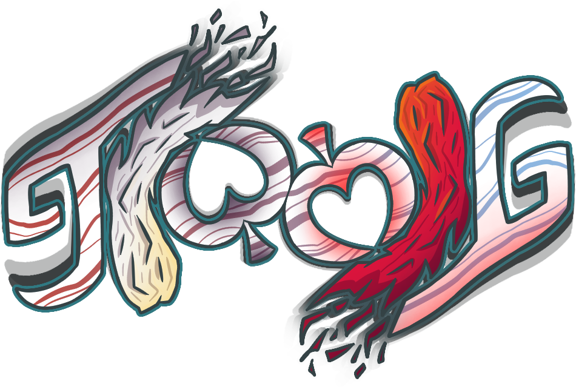

TIWMIG ("This Is Where My Ideas Go") is a mod I'm developing solo where I add whatever comes to mind. It's mainly just a way for me to explore the possibilities in Balatro modding, as well as practice pixel art and staying disciplined in scripting.

I probably won't take content suggestions or sprite submissions. I will, however, enthusiastically regard suggestions on how to improve existing code or art!

# Current content
## Jokers
* **Generic Brand Joker** - All shop prices are 30% off
* **Bag of Chips** - Sell this Joker to double round score
* Poutine components: Self-destructs after 5 hands; can combine with one another to make almost-Poutine Jokers
  * **French Fries** - +50 Chips
  * **Gravy** - +8 Mult
  * **Cheese Curds** - +$2
* Almost-Poutine Jokers: Self-destructs after 8 hands; can combine with one of the missing Poutine components to create Poutine
  * **Frite Sauce** - +75 Chips, +12 Mult
  * **Chesy Gravy** - +12 Mult, +$3
  * **Chips n' Cheese** - +$3, +75 Chips
* **Poutine** - +100 Chips, +16 Mult, and +$4 for the next 10 hands
* **"egg"** - +9 Chips

# Special thanks
A huge thank-you to the modding community in the official Balatro Discord server for helping with a variety of modding problems. Thanks to Steamodded for being a really easy framework to work with, and having a comprehensible documentation and example mods.